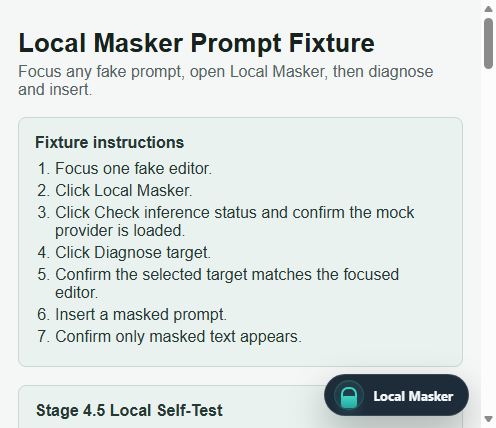
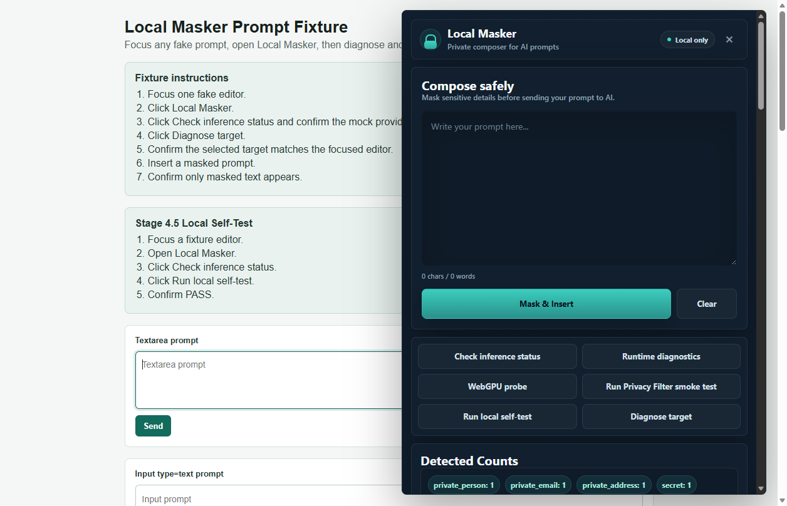

# Local Masker User Guide

Local Masker is a local-first privacy composer for AI prompt fields. It lets a user write a prompt, mask sensitive values, and insert only the cleaned prompt into supported AI websites.



## What It Does

- Adds a floating **Local Masker** button on supported AI pages.
- Opens a private composer owned by the extension.
- Detects sensitive details before prompt insertion.
- Replaces private details with placeholders such as `[[LM_PRIVATE_EMAIL_...]]`.
- Inserts the masked prompt into the active AI composer.
- Keeps masking local in the browser.

## Supported Sites

- ChatGPT: `https://chatgpt.com/*`
- Legacy ChatGPT: `https://chat.openai.com/*`
- Claude: `https://claude.ai/*`
- Gemini: `https://gemini.google.com/*`

The development manifest also supports `localhost` and `127.0.0.1` for fixture testing. The release build removes those local matches.

## Basic Flow

1. Open a supported AI website.
2. Click the **Local Masker** floating button.
3. Write the prompt inside Local Masker.
4. Click **Mask & Insert**.
5. Review the masked prompt in the AI input before sending.

## First-Time Privacy Filter Setup

Local Masker can use a stronger local Privacy Filter model for semantic private details such as names and addresses. On first use, the extension asks before setup because model data can take a few minutes to download.

Regex masking remains available immediately and is used as a safe fallback.

## What Gets Masked

Local Masker is designed to detect common sensitive values, including:

- Email addresses
- API keys and secrets
- Account numbers
- Phone numbers
- URLs and dates
- Names and addresses when the local Privacy Filter model is available

## Testing Screenshot

The screenshot below shows the development fixture used for extension QA. The production UI hides development diagnostics on real AI websites.



## Privacy Notes

- Prompt masking happens inside the browser extension.
- No backend service is included.
- No analytics or telemetry are included.
- Placeholder vault data stays in content-script memory for the active page session.
- The extension stores only non-sensitive setup/status metadata.

See the full [Privacy Policy](../PRIVACY.md).

## Troubleshooting

If the Local Masker button does not appear:

1. Run `npm install`.
2. Run `npm run build`.
3. Open `chrome://extensions`.
4. Enable **Developer mode**.
5. Load this project folder as an unpacked extension.
6. Refresh the supported AI page.

For local validation, run:

```bash
npm run verify
npm run e2e:fixture
```
